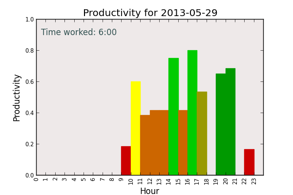

# pomodoro_daily_chart.py #

Author: Brett Hutley <brett@hutley.net>

This code is to extract the list of Pomodoros from my Mac OS/X calendar using the program [callistevents](https://github.com/bhutley/callistevents) and then create a bar-chart aggregating the work done each hour, in order to show how my productivity looks during the day.

By default it will create a chart called pomodoro_daily_chart.png in the current directory. You can specify a different output file using the '-o' command-line option.

In order to run it, you will need to modify the path to the callistevents program by changing the callistevents_prog variable.

This is an example of what the chart looks like:

